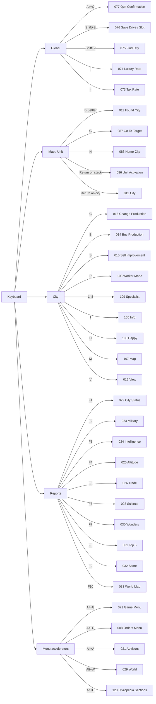

# Civilization I Hotkeys and Input-to-Scene Map

This document is the canonical keyboard/input reference for the Civilization-I-inspired UI layer in `docs/ui/civ1/`.

## Scope

The historical baseline is the original IBM PC/DOS interface described by the Civilization manual. Other ports may differ. CivilizationClone clients should preserve the **logical action** even when a physical key differs, and should treat the DOS binding as the default compatibility binding where practical.

The scene IDs below refer to `SCENE_INDEX.md`. A key may either navigate to another scene, open a modal/subview, enter a targeting/editing mode, or execute an engine command while remaining on the same scene.

## Key notation

| Notation | Meaning |
|---|---|
| `Return` | Enter/Return |
| `Esc` | Escape/back |
| `Space` | Spacebar |
| `KP1..KP9` | numeric keypad directions/selection |
| `Shift+KP` | shifted keypad direction |
| `Alt+X` | hold Alt and press X |
| `Shift+X` | hold Shift and press X |
| `1..8` | number key used for specialist/info selectors |

## 1. Global / interface controls

| Binding | Logical action | Primary context | Scene effect |
|---|---|---|---|
| `C` | center map on active unit | map | stay on `CIV1-UI-007` |
| `KP8` / `KP2` | move menu highlight up/down | menus | stay in current menu scene |
| `Return` | choose highlighted option / activate cursor target | menus/map cursor | transition depends on selection |
| `Space` | choose highlighted menu item **or** no orders | menu / active unit | context-sensitive |
| `Esc` | leave menu/screen/back | most scenes | return to caller/parent |
| `Tab` | toggle keyboard map cursor | map | `CIV1-UI-007` cursor mode |
| `Alt+H` | contextual menu help | supported research/production menus | `CIV1-UI-166` or `167` |
| `Alt+Q` | quit game | global/map | `CIV1-UI-077` |
| `Shift+KP direction` | jump/scroll map | map | stay on `CIV1-UI-007` |
| `Alt+V` | toggle sound | global/map | no scene change |
| `T` | toggle units on/off | map | stay on `CIV1-UI-007` |

## 2. Menu-bar accelerators

The IBM keyboard-only interface opens a menu with `Alt` plus the first letter of the menu name.

| Binding | Menu | Canonical destination |
|---|---|---|
| `Alt+G` | Game | `CIV1-UI-071` |
| `Alt+O` | Orders | `CIV1-UI-008` |
| `Alt+A` | Advisors | `CIV1-UI-021` |
| `Alt+W` | World | `CIV1-UI-029` |
| `Alt+C` | Civilopedia | `CIV1-UI-128` (section menu); clients may render `019` as the combined browser |

Within an open menu, `KP8/KP2` or arrows move the highlight, `Return`/`Space` activates, and `Esc` returns.

## 3. Direct report / utility hotkeys

| Binding | Historical function | Canonical destination |
|---|---|---|
| `-` | change Luxury rate | `CIV1-UI-074` |
| `=` | change Tax rate | `CIV1-UI-073` |
| `Shift+?` | Find City | `CIV1-UI-075` |
| `Shift+S` | Save Game | `CIV1-UI-076` -> `056` |
| `F1` | City Status | `CIV1-UI-022` |
| `F2` | Military Advisor | `CIV1-UI-023` |
| `F3` | Intelligence Advisor | `CIV1-UI-024` |
| `F4` | Attitude Advisor | `CIV1-UI-025` |
| `F5` | Trade Advisor | `CIV1-UI-026` |
| `F6` | Science Advisor | `CIV1-UI-028` |
| `F7` | Wonders of the World | `CIV1-UI-030` |
| `F8` | Top 5 Cities | `CIV1-UI-031` |
| `F9` | Civilization Score | `CIV1-UI-032` |
| `F10` | World Map | `CIV1-UI-033` |

`F1..F10` should return to the scene that invoked them unless an authoritative game event supersedes the return path.

## 4. Map cursor navigation

| Binding | Action | Transition |
|---|---|---|
| `Tab` | enable/disable cursor | `007` <-> `007:cursor-mode` |
| `KP1..KP9` | move cursor | remain `007` |
| `Shift+KP` | jump-scroll | remain `007` |
| `Return` on a city | open city display | `007 -> 012` |
| `Return` on a fortified/sentry unit stack | open activation chooser | `007 -> 086` |
| `Return` in `086` | activate highlighted unit | `086 -> 007` |
| `Esc` in `086` | cancel activation | `086 -> 007` |

## 5. Unit command keys

These keys are context-sensitive. An unavailable order should be disabled rather than silently interpreted as another action.

| Binding | Historical order | Canonical scene/mode | Result |
|---|---|---|---|
| `I` | agricultural improvement | `007` / `089` | submit settler improvement command |
| `F` | build fortress / fortify | `007` / `089` | command; normally remain map |
| `R` | build road / railroad | `007` / `089` | command; available variant depends on tech/context |
| `P` | clear pollution | `007` / `089` | command; remain map |
| `Shift+D` | disband | `GENERIC-CONFIRM` | confirm -> map/next unit |
| `B` | found new city | `007 -> 011` | confirm name -> `012` |
| `G` | Go To | `007 -> 087` | choose target -> `007` |
| `H` | change Home City | `007 -> 088` | choose/confirm -> `007` |
| `M` | industrial improvement | `007` / `089` | submit mine/industrial improvement command |
| `KP1..KP9` | move active unit | `007` | move/combat/event transition |
| `Space` | no orders this turn | `007` | next active unit / `079` |
| `Shift+P` | pillage | `007` | submit pillage command |
| `S` | sentry | `007` | submit sentry command |
| `U` | unload ship | `007` | unload; remain map |
| `W` | wait | `007` | cycle active unit; remain map |

### Movement side effects

A movement key can transition from `007` into event-driven scenes, including `036`/`131` diplomacy contact, `040` diplomat-at-city missions, `091` bribe offers, `099` caravan delivery, `100` caravan wonder contribution, `101..104` minor-tribe/barbarian outcomes, `141` declaration of war, and `161..165` city/combat/capture result scenes. These are engine-authoritative transitions, not direct key bindings.

## 6. City display keys

The original keyboard-only interface gives dedicated city commands and also uses the first letter of a labeled button.

| Binding | City action | Canonical destination/effect |
|---|---|---|
| `P` | change city production map / worker-placement mode | `012 -> 108` |
| `1..8` | cycle a numbered specialist | `012/108 -> 109` (or inline update) |
| `S` | sell improvement | `012 -> 015` |
| `A` | activate unit in city | `012/105 -> 111` |
| `C` | change production | `012 -> 013` |
| `B` | buy production | `012 -> 014` |
| `I` | Info button | `012 -> 105` |
| `H` | Happy button | `012 -> 106` |
| `V` | View button | `012 -> 016` |
| `M` | Map button | `012 -> 107` |
| `E` | Exit button | `012 -> 007` |
| `Return` in worker mode | remove/add worker on selected tile | stay `108` |
| `Esc` in worker mode | leave worker-placement mode | `108 -> 012` |

The first-letter rule is contextual: for example `B` means **Found City** on the map for a Settler but **Buy Production** in the city display.

## 7. Civilopedia / research / production help

| Binding | Context | Transition |
|---|---|---|
| `Alt+C` | map/menu bar | `007 -> 128` |
| `Alt+H` | choose-research menu | `017 -> 166` |
| `Alt+H` | change-production menu | `013 -> 167` |
| `Esc` | help page | `166 -> 017`, `167 -> 013` |
| `Return` / first-letter button | Civilopedia selection | `128 -> 019/020/129/130` depending client composition |

The historical Civilopedia entry has a history/description page and a gameplay-significance page; CivilizationClone keeps these individually addressable as `129` and `130`.

## 8. Intelligence report numeric selectors

The manual notes one exception to the first-letter button rule: Intelligence-report `Info` buttons are numbered.

| Binding | Context | Transition |
|---|---|---|
| `1..N` | `CIV1-UI-024` Intelligence Advisor | `024 -> 127` for selected rival |
| `Esc` | Intelligence detail | `127 -> 024` |

## 9. Setup/text-entry conventions

| Binding | Context | Effect |
|---|---|---|
| `Esc` | historical tribe selection | enter custom tribe-name path `005/067` |
| typing | tribe/ruler/city/find-city/save text fields | edit current field |
| `Return` | text-entry scene | accept value / advance |
| `Esc` | text-entry scene | cancel/back when permitted |
| menu movement + `Return` | setup lists | select highlighted choice |

## 10. End-of-turn / presentation clearing

Historical presentation and notification screens commonly accept `Return`, `Space`, or a mouse button to clear/continue. For CivilizationClone, map these to the logical `continue` action.

`CIV1-UI-079` End of Turn explicitly uses `Return` to commit the end of the turn. While `079` is displayed, read-only city/advisor/report navigation may still be available; once `continue` is submitted, the engine advances the turn.

## 11. Context precedence

A single physical key can mean different things in different scenes. Clients should resolve keys in this order:

1. top modal/confirmation;
2. active targeting/editing mode;
3. current scene-local binding;
4. menu binding;
5. map/unit binding;
6. global binding.

| Key | Map | City | Menu |
|---|---|---|---|
| `B` | Found City (Settler) | Buy Production | button/selection if applicable |
| `P` | Clear Pollution (unit) | worker-placement mode | context-specific |
| `S` | Sentry | Sell Improvement | Save only as `Shift+S` |
| `M` | Industrial improvement | Map subview | menu mnemonic only with `Alt` |
| `Space` | No Orders | activate focused button if exposed | choose highlighted menu option |

## 12. Hotkey -> scene Mermaid chart



## 13. Implementation contract

Clients should bind physical input to stable logical actions, not directly to rendering code. Suggested action IDs:

```text
ui.back
ui.activate
ui.menu.game
ui.menu.orders
ui.menu.advisors
ui.menu.world
ui.menu.civilopedia
map.center_active
map.toggle_cursor
map.jump
map.toggle_units
unit.move
unit.wait
unit.no_orders
unit.sentry
unit.fortify
unit.build_city
unit.goto
unit.home_city
unit.improve_agricultural
unit.improve_industrial
unit.build_route
unit.clear_pollution
unit.pillage
unit.unload
unit.disband
city.change_production
city.buy_production
city.sell_improvement
city.worker_mode
city.specialist_cycle
city.activate_unit
report.city_status
report.military
report.intelligence
report.attitude
report.trade
report.science
report.wonders
report.top_cities
report.score
report.world_map
game.find_city
game.save
game.quit
game.tax_rate
game.luxury_rate
help.context
```

A client may provide additional modern bindings, but the historical binding should remain discoverable in a `classic` controls profile.

## Sources

Primary historical reference:

- Civilization Manual HTML, CivFanatics: https://www.civfanatics.com/content/civ1/manual/civ1_man.htm

Cross-check:

- Civilization Wiki, Control bindings (Civ1): https://civilization.fandom.com/wiki/Control_bindings_%28Civ1%29
