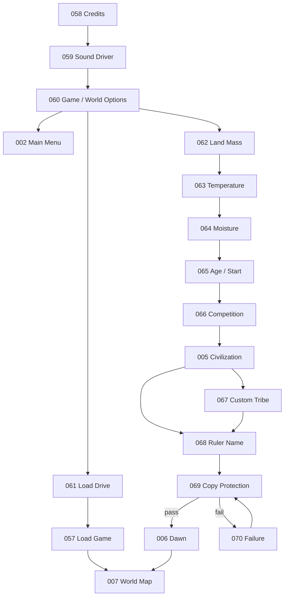
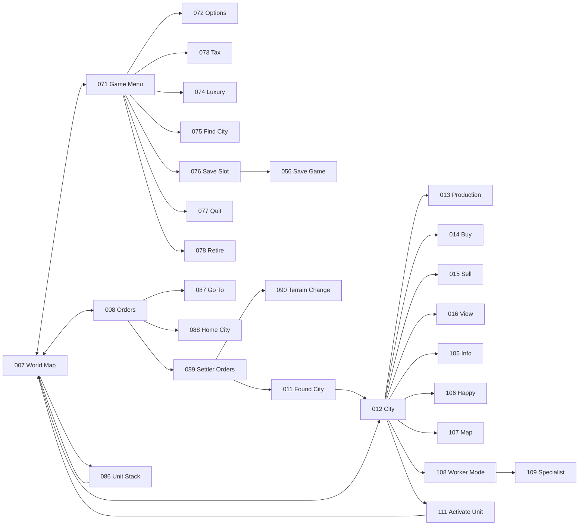
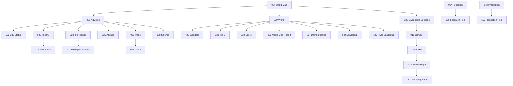
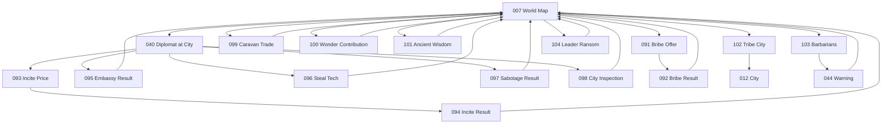
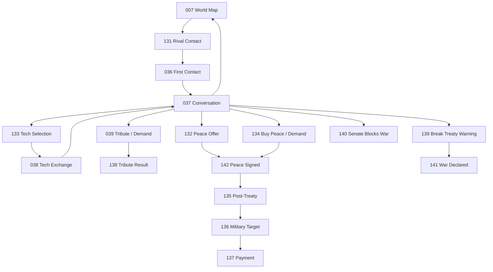
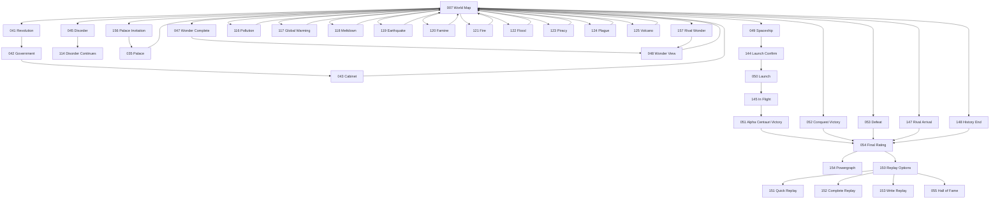

# Civilization I Scene-to-Scene Navigation

This document defines the canonical **UI navigation topology** for all `CIV1-UI-001..168` scene/state IDs.

It complements:

- `SCENE_INDEX.md` — what each scene is;
- `HOTKEYS.md` — which physical keys/logical actions invoke scenes;
- `SCENE_GRAPH.md` — family-level and coverage diagrams;
- `.ascii` / `.ansii` files — visual composition.

## Transition semantics

Every edge is one of these types:

| Type | Meaning |
|---|---|
| `direct` | user explicitly selects a menu/button/hotkey |
| `return` | close/back returns to caller/parent |
| `mode` | enters/exits targeting or editing mode |
| `event` | engine-authoritative game event injects the scene |
| `terminal` | endgame/exit path |
| `overlay` | modal is stacked above the caller and returns there |

Clients should keep a `return_scene`/modal stack so reports, help, confirmations, and event presentations can return to the correct caller.

## Core invariant

`CIV1-UI-007` Main World Map is the primary gameplay hub. `CIV1-UI-012` City Management is the secondary persistent workspace. Most reports and dialogs eventually return to one of these two scenes unless the engine advances the turn or enters endgame.

# Complete navigation matrix

## 001-018 — boot, map, city, research

| ID | Scene | Common entry | Primary exits |
|---|---|---|---|
| 001 | Title Screen | `058/060` or program start | `002` |
| 002 | Main Menu | `001`, end/exit flows | `003`, `057`, `060`, exit |
| 003 | World Creation | `002` or `060` | `004` or custom-world `062` |
| 004 | Difficulty Selection | `003` | `005`, `066` |
| 005 | Civilization / Leader Selection | `004`, `066` | `006`, custom tribe `067` |
| 006 | Opening / Dawn | `005`, `068`, `069` pass | `007` |
| 007 | Main World Map | setup/load/most returns | `008-010`, `012`, `017`, `019/128`, `021`, `029`, `036/131`, `040`, `041`, `049`, `056`, `071`, `075`, `079`, `086-104`, events/endgame |
| 008 | Orders Menu | `007`, `Alt+O` | `087`, `088`, `089`, `011`, command -> `007`, `Esc -> 007` |
| 009 | Tile Information | map inspect | `007`, Civilopedia help `020/128` |
| 010 | Unit Information | map/unit inspect | `007` |
| 011 | Found City | `007` + Settler `B`, `089` | confirm -> `012`; cancel -> `007` |
| 012 | City Management | `007`, `011`, city events | `013-016`, `105-111`, `168`, `007` |
| 013 | Change Production | `012`, `113` | select/cancel -> `012`; help -> `167` |
| 014 | Buy Production | `012` | buy/cancel -> `012` |
| 015 | Sell Improvement | `012` | sell/cancel -> `012` |
| 016 | City View | `012`, `112`, `157` view path | `012`/caller |
| 017 | Choose Research | `007`, after `018` | select -> `007`; help -> `166` |
| 018 | Technology Discovered | research completion, `101/162` results | `017`, `020`, `007` |

## 019-034 — Civilopedia, advisors, world reports

| ID | Scene | Common entry | Primary exits |
|---|---|---|---|
| 019 | Civilopedia Browser | `128`, `Alt+C` compatibility route | `020`, `129`, `130`, caller |
| 020 | Civilopedia Entry | `019`, `009`, `018` | `019/128`, `129/130`, caller |
| 021 | Advisors Hub | `007`, `Alt+A` | `022-028`, `007` |
| 022 | City Status Advisor | `021`, `F1` | caller (`007` normally) |
| 023 | Military Advisor | `021`, `F2` | `126`, caller |
| 024 | Intelligence Advisor | `021`, `F3` | numbered Info -> `127`; caller |
| 025 | Attitude Advisor | `021`, `F4` | caller |
| 026 | Trade Advisor | `021`, `F5` | `027`, caller |
| 027 | Tax/Luxury/Science Rates | `026`, `073/074` convergence | accept -> caller |
| 028 | Science Advisor | `021`, `F6` | `017` optional research path; caller |
| 029 | World Menu | `007`, `Alt+W` | `030-034`, `049`, `143`, `007` |
| 030 | Wonders of the World | `029`, `F7` | caller |
| 031 | Top Five Cities | `029`, `F8` | caller |
| 032 | Civilization Score | `029`, `F9`, endgame score path | caller/endgame |
| 033 | Known World Map | `029`, `F10` | caller |
| 034 | Demographics | `029` | caller |

## 035-057 — diplomacy, government, events, space, results, persistence

| ID | Scene | Common entry | Primary exits |
|---|---|---|---|
| 035 | Palace | `156`, periodic reward | `007`/caller |
| 036 | First Contact | movement/contact event, `131` | receive -> `037`; refuse -> `007` |
| 037 | Diplomacy Conversation | `036`, `131`, `040 Meet With King` | `038`, `039`, `132-142`, end meeting -> `007` |
| 038 | Technology Exchange | `037`, `133` | `037`/`135` |
| 039 | Tribute / Demand | `037` | result -> `138`/`037`; refusal may lead `141` |
| 040 | Diplomat at Foreign City | diplomat movement into rival city | `093`, `095-098`, `037`, cancel -> `007` |
| 041 | Revolution | `071` Game menu | `042` after anarchy/event progression |
| 042 | Form a Government | `041` / Pyramids path | `043` |
| 043 | New Cabinet | `042` | `007` |
| 044 | Barbarian Warning | event / `103` | `007` |
| 045 | Civil Disorder | city-turn event | `012`, `114`, `007` |
| 046 | City Captured | capture event | `162/163` if loot, then `007` |
| 047 | Wonder Completed | own wonder completion | `048` or `007` |
| 048 | Wonder Illustration | `047`, `157` view path | `007`/caller |
| 049 | Spaceship Overview | `029`, map space command | `144`, `145`, close -> `007` |
| 050 | Spaceship Launch | `144` confirm | `145`/`007`; eventual `051` by event |
| 051 | Alpha Centauri Victory | arrival event | `054`, optionally `149` |
| 052 | Conquest Victory | victory event | `054`, optionally `149` |
| 053 | Defeat | destruction/end event | `054`, `155` |
| 054 | Final Rating | `051-053`, `147/148` | `154`, `150`, `055` |
| 055 | Hall of Fame | `054`, `060` | `002/060` |
| 056 | Save Game | `076`, Game menu/`Shift+S` | save/cancel -> `007`/caller |
| 057 | Load Game | `002/060/061` | load -> `007`; cancel -> entry scene |

## 058-085 — system/setup, Game menu, turn flow, historians

| ID | Scene | Common entry | Primary exits |
|---|---|---|---|
| 058 | Credits / Opening Credits | program start | `059`, `060`, `001` |
| 059 | Sound Driver Selection | startup | `060`/`001` |
| 060 | Game / World Options | startup/title options | `003`, `057/061`, `062`, `055`, `002` |
| 061 | Load Drive Prompt | `060`, load path | `057`; cancel -> `060` |
| 062 | Customize World - Land Mass | `003/060` custom world | `063` |
| 063 | Customize World - Temperature | `062` | `064` |
| 064 | Customize World - Moisture | `063` | `065` |
| 065 | Customize World - Age / Start | `064` | `066`/setup continuation |
| 066 | Level of Competition | setup | `005`/`067` |
| 067 | Custom Tribe Name Entry | `005` + `Esc`, `066` custom option | `068`/`005` |
| 068 | Ruler Name Entry | tribe selection | `006` or `069` when copy protection applies |
| 069 | Copy Protection Quiz | startup/setup checkpoint | pass -> `006`; fail -> `070` |
| 070 | Copy Protection Failure / Penalty | failed `069` | retry `069`, abort `002` |
| 071 | Game Menu | `007`, `Alt+G` | `041`, `072-078`, `007` |
| 072 | Game Options Submenu | `071` | toggle options inline; `080` may appear; back -> `071/007` |
| 073 | Tax Rate Dialog | `071`, `=` | accept -> `007`/caller; may share model with `027` |
| 074 | Luxury Rate Dialog | `071`, `-` | accept -> `007`/caller; may share model with `027` |
| 075 | Find City Prompt | `071`, `Shift+?` | found -> centered `007`; cancel -> `007` |
| 076 | Save Drive / Slot Prompt | `071`, `Shift+S` | `056`; cancel -> `007` |
| 077 | Quit Confirmation | `071`, `Alt+Q` | confirm -> program exit; cancel -> caller |
| 078 | Retire Confirmation | `071` | confirm -> `054/154/150`; cancel -> `007` |
| 079 | End of Turn Prompt | no active units / option enabled | `Return` -> next-turn `007`; read-only detours may return to `079` |
| 080 | Instant Advice | option/event context | acknowledge -> caller (`007/012` normally) |
| 081 | Historian Ranking - Advancement | periodic historian event | `007` |
| 082 | Historian Ranking - Happiness | periodic historian event | `007` |
| 083 | Historian Ranking - Power | periodic historian event | `007` |
| 084 | Historian Ranking - Size | periodic historian event | `007` |
| 085 | Historian Ranking - Wealth | periodic historian event | `007` |

## 086-104 — unit modes, Diplomats, Caravans, minor tribes

| ID | Scene | Common entry | Primary exits |
|---|---|---|---|
| 086 | Unit Stack Activation | `007` cursor + Return on stack | activate/cancel -> `007` |
| 087 | Go To Destination Targeting | `007/008`, `G` | choose/cancel -> `007` |
| 088 | Home City Reassignment | `007/008`, `H` | choose/cancel -> `007` |
| 089 | Settler Context Orders | `008`/settler context | `090`, `011`, command -> `007` |
| 090 | Change Terrain Order | `089` | confirm/cancel -> `007/089` |
| 091 | Diplomat Bribe Enemy Unit Offer | diplomat enters rival-unit square | pay -> `092`; refuse -> `007` |
| 092 | Diplomat Bribe Result | `091` | `007` |
| 093 | Diplomat Incite Revolt Price | `040` | pay -> `094`; refuse -> `007/040` |
| 094 | Diplomat Incite Revolt Result | `093` | `007` |
| 095 | Diplomat Establish Embassy Result | `040` | `007` |
| 096 | Diplomat Steal Technology Result | `040` | `018/020` optional detail, then `007` |
| 097 | Diplomat Industrial Sabotage Result | `040` | `007` |
| 098 | Enemy City Inspection | `040` | close -> `007` |
| 099 | Caravan Trade Route Delivery | Caravan enters destination city | result -> `007` |
| 100 | Caravan Wonder Contribution Prompt | Caravan enters own city building Wonder | contribute/keep -> `007/012` |
| 101 | Minor Tribe - Ancient Wisdom | exploration event | `018`/`007` |
| 102 | Minor Tribe - Joins as City | exploration event | `012`/`007` |
| 103 | Minor Tribe - Barbarians | exploration event | `044`/`007` |
| 104 | Barbarian Leader Ransom | leader capture event | `007` |

## 105-130 — city subviews, city/world events, report pages, Civilopedia pages

| ID | Scene | Common entry | Primary exits |
|---|---|---|---|
| 105 | City Information Tab | `012`, `I` | `106/107/111/012` |
| 106 | City Happiness Chart | `012`, `H`, `105` tabs | `105/107/012` |
| 107 | City Map Subview | `012`, `M`, `105` tabs | `105/106/012` |
| 108 | City Citizen Reassignment Mode | `012`, `P` | `109`, `Esc -> 012` |
| 109 | City Specialist Assignment | `012/108`, `1..8` | cycle -> `108/012` |
| 110 | Rename City Prompt | city rename action | accept/cancel -> `012` |
| 111 | City Unit Activation | `012/105`, `A` | activated unit -> `007`; cancel -> `012` |
| 112 | City Improvement Completed / View | build completion event | `016` view or `012/007` |
| 113 | Wonder Race Lost / Forced Production Change | rival completes same wonder | `013` |
| 114 | Civil Disorder Continues | after `045` / repeated city event | `012`/`007` |
| 115 | We Love the King Day | city event | `012`/`007` |
| 116 | Pollution Appears | environment event | center/ack -> `007` |
| 117 | Global Warming | environment event | `007` |
| 118 | Nuclear Meltdown | city/environment event | `012` optional inspect, then `007` |
| 119 | Disaster - Earthquake | city disaster event | `012` optional inspect, then `007` |
| 120 | Disaster - Famine | city disaster event | `012` optional inspect, then `007` |
| 121 | Disaster - Fire | city disaster event | `012` optional inspect, then `007` |
| 122 | Disaster - Flood | city disaster event | `012` optional inspect, then `007` |
| 123 | Disaster - Piracy | city disaster event | `012` optional inspect, then `007` |
| 124 | Disaster - Plague | city disaster event | `012` optional inspect, then `007` |
| 125 | Disaster - Volcano | city disaster event | `012` optional inspect, then `007` |
| 126 | Military Advisor - Casualties Page | `023` page/detail | back -> `023` |
| 127 | Intelligence Advisor - Detail Page | `024` numbered Info | back -> `024` |
| 128 | Civilopedia Section Menu | `007`, `Alt+C` | `019`, `129/130`, caller |
| 129 | Civilopedia Entry - History Page | `128/019/020` | next -> `130`; back -> index/caller |
| 130 | Civilopedia Entry - Gameplay Page | `129` | previous -> `129`; close -> index/caller |

## 131-142 — extended diplomacy

| ID | Scene | Common entry | Primary exits |
|---|---|---|---|
| 131 | Rival Initiates Contact | diplomacy event | `036/037`; refuse -> `007` |
| 132 | Peace Offer | `037/131`, war negotiation | accept -> `142`; reject -> `037/141` |
| 133 | Technology Trade Selection | `037` exchange path | `038`; cancel -> `037` |
| 134 | Buy Peace / Rival Demand | `037/132` | pay/offer -> `142/135`; refuse -> `037/141` |
| 135 | Post-Treaty Negotiation Menu | `142` or successful negotiation | `136`, `138`, `037`, end -> `007` |
| 136 | Military Proposal - Target | `135` | target -> `137`; cancel -> `135` |
| 137 | Military Proposal - Payment | `136` | accept may -> `141`; decline -> `135` |
| 138 | Demand Tribute Result | `039/135` | `135/037/007` |
| 139 | Break Treaty Warning | aggressive action against treaty partner | proceed -> `141`; cancel -> caller/`007` |
| 140 | Senate Blocks War | Republic/Democracy diplomacy event | acknowledge -> `037/007` |
| 141 | Declaration of War | negotiation or movement event | `037` or `007` |
| 142 | Peace Treaty Signed | successful peace negotiation | `135`, `037`, `007` |

## 143-168 — space, endgame/replay, late events, contextual help

| ID | Scene | Common entry | Primary exits |
|---|---|---|---|
| 143 | Rival Spaceship Status | `029` Spaceships report, `146` inspect | caller (`029/007`) |
| 144 | Spaceship Launch Confirmation | `049` launch action | launch -> `050`; keep building -> `049` |
| 145 | Spaceship In Flight | `049` after launch / map report | close -> `007`; arrival event -> `051` |
| 146 | Rival Spaceship Launch | rival launch event | inspect -> `143`; acknowledge -> `007` |
| 147 | Rival Alpha Centauri Arrival | rival arrival endgame event | `054` |
| 148 | Automatic History End | turn-limit/history-end event | `054` |
| 149 | Continue Playing After Victory | `051/052` optional continuation | continue -> `007`; end -> `054/150` |
| 150 | Replay Options | retirement/endgame sequence | `151`, `152`, `153`, `154`, `055`, exit |
| 151 | Quick Replay | `150` | completion/back -> `150` |
| 152 | Complete Replay | `150` | completion/back -> `150` |
| 153 | Write Replay to Disk Result | `150` export | `150` |
| 154 | Powergraph | retirement/endgame sequence | `150`, `055`, exit |
| 155 | Destruction - Replay Offer | civilization destroyed | replay -> `150`; exit/end -> terminal |
| 156 | Palace Improvement Invitation | population/adulation event | view -> `035`; dismiss -> `007` |
| 157 | Rival Wonder Completed Announcement | wonder event | view -> `048`; continue -> `007` |
| 158 | Wonder Obsolete Announcement | technology/event | `007` |
| 159 | Treasury Shortfall / Improvement Sold | economy turn event | `012` optional inspect; `007` |
| 160 | Unsupported Unit Lost | support/economy event | `007` |
| 161 | City Destroyed | capture/combat/city-size event | `007` |
| 162 | City Capture Loot - Technology | after `046` | detail -> `018/020`; acknowledge -> `007` |
| 163 | City Capture Loot - Gold | after `046` | `007` |
| 164 | Nuclear Attack Result | combat event | `007` |
| 165 | SDI Interception | combat event | `007` |
| 166 | Research Menu Civilopedia Help | `017`, `Alt+H` | close -> `017` |
| 167 | Production Menu Civilopedia Help | `013`, `Alt+H` | close -> `013` |
| 168 | City Advisor Recommendation Overlays | `012/108` advisor recommendation | acknowledge/apply -> `012` |

# Navigation charts

## Boot/setup/load



## Map, menus, units, city



## Advisors, reports, Civilopedia



## Diplomat, Caravan, exploration events



## Diplomacy



## Events, government, space, endgame



# Hotkey/direct-route overlays

Direct keyboard routes are edges layered on top of the normal navigation graph:

```text
Alt+G  -> 071 Game Menu
Alt+O  -> 008 Orders
Alt+A  -> 021 Advisors
Alt+W  -> 029 World
Alt+C  -> 128 Civilopedia Sections
Alt+Q  -> 077 Quit Confirmation
Shift+S -> 076 Save Drive / Slot -> 056 Save Game
Shift+? -> 075 Find City
=      -> 073 Tax Rate
-      -> 074 Luxury Rate
F1     -> 022 City Status
F2     -> 023 Military Advisor
F3     -> 024 Intelligence Advisor
F4     -> 025 Attitude Advisor
F5     -> 026 Trade Advisor
F6     -> 028 Science Advisor
F7     -> 030 Wonders
F8     -> 031 Top Five Cities
F9     -> 032 Civilization Score
F10    -> 033 World Map
G      -> 087 Go To targeting (active unit)
H      -> 088 Home City (active unit)
B      -> 011 Found City (Settler)
Return -> 012 City or 086 unit stack (map cursor target)
C/B/S/P/A/I/H/V/M/E -> city-local actions, see HOTKEYS.md
```

# Navigation implementation rules

1. **Do not hard-code scene changes inside render widgets.** Emit logical actions to a scene router.
2. **Use a return stack.** Reports, Civilopedia, help, and overlays should return to their caller.
3. **Engine events can preempt the UI.** Event-driven scenes (`044-048`, `081-085`, `101-104`, `112-125`, `131`, `140-165`) are pushed by authoritative events.
4. **Modes are not separate saves/states.** `086-090`, `108-109`, `111` are transient interaction modes around authoritative game state.
5. **Terminal paths lock ordinary navigation** once the game is committed to final results, except explicit continue-playing/replay options.
6. **Hotkeys and menus must converge on the same scene/action.** For example F1 and Advisors -> City Status must produce the same `CIV1-UI-022` route.
7. **Context wins over global bindings.** `B`, `P`, `S`, `M`, `Space`, and number keys are resolved using the precedence rules in `HOTKEYS.md`.
8. **Clients may combine visual panels but must preserve scene IDs** for automated playtesting, accessibility, screenshots, and cross-client parity.
