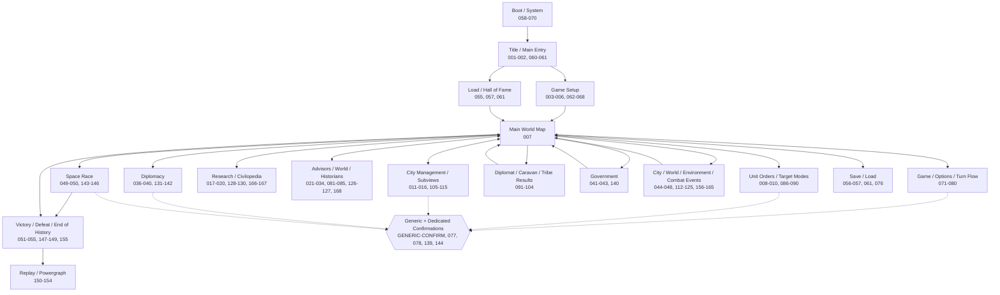
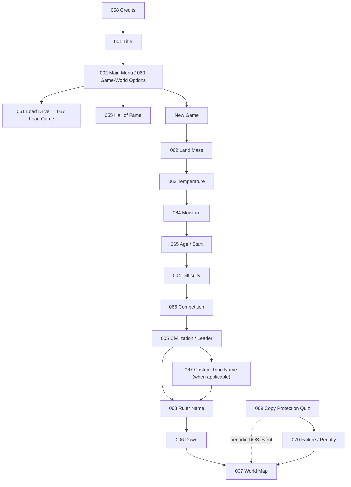
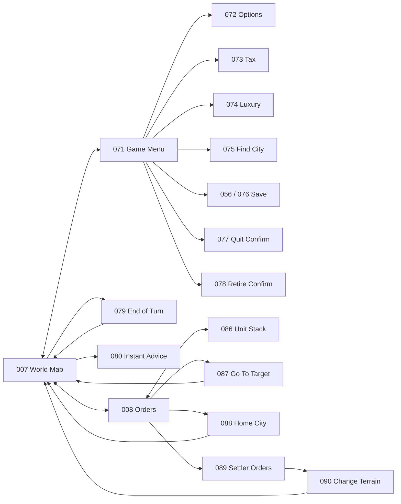
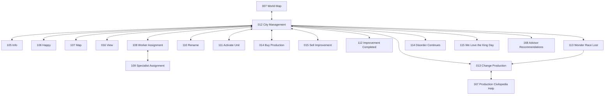
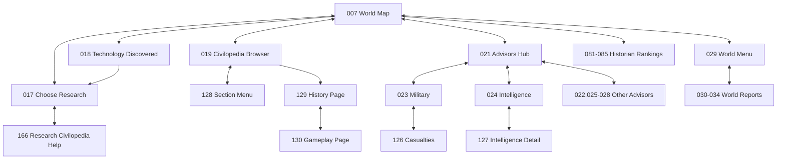
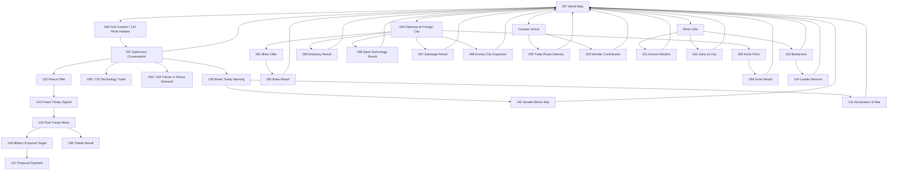
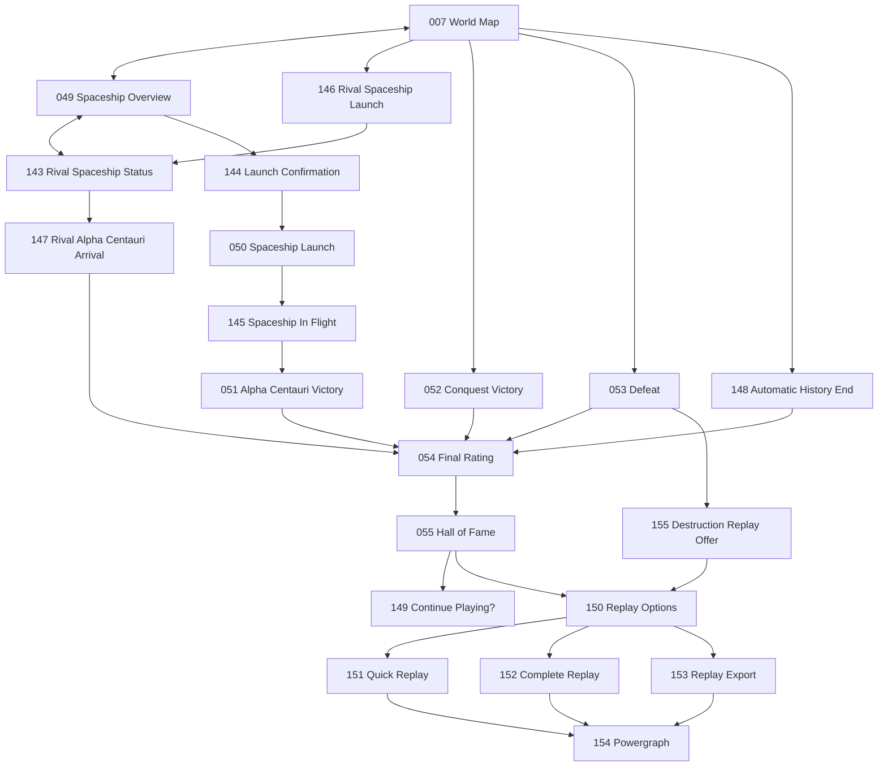
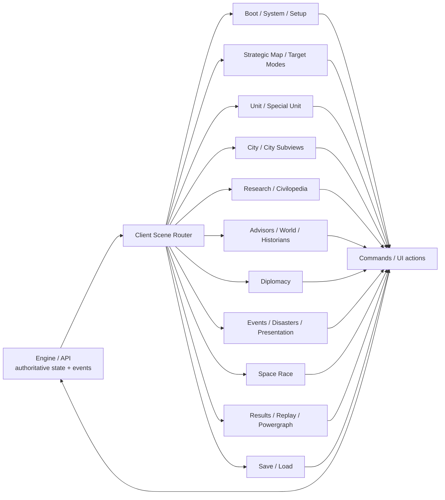

# Civ1-Inspired Overall Scene Graph

This document is the canonical navigation map for the Civilization-I-inspired UI reference in `docs/ui/civ1/`.

The catalog contains **168 distinct UI state templates**. The engine remains authoritative for whether a transition is legal; this document describes expected client navigation and explicitly shows every canonical scene ID. `SCENE_INDEX.md` remains authoritative for each scene's full name/family/action semantics, while `COVERAGE_AUDIT.md` explains the expanded scope.

## Overall ASCII scene graph

```text
                                      CIVILIZATION CLONE
                                             |
                  +--------------------------+---------------------------+
                  |                                                      |
          BOOT / SYSTEM 058-070                                  MAIN ENTRY 001-002
                  |                                                      |
                  +--------------------------+---------------------------+
                                             |
                                      GAME SETUP 003-006
                                        +    060-068
                                             |
                                             v
+====================================================================================+
|                            CIV1-UI-007 MAIN WORLD MAP                              |
|                                                                                    |
|  GAME/SYSTEM          UNIT MODES           INFORMATION          DIPLOMACY            |
|  071-080              008-010,086-090      019-034,080-085      036-040,131-142     |
|      |                     |                    |                     |              |
|      +---------------------+--------------------+---------------------+              |
|                                             |                                      |
|              +------------------------------+------------------------------+       |
|              |                              |                              |       |
|              v                              v                              v       |
|       CITY MANAGEMENT                 SPECIAL UNITS                  EVENTS          |
|       011-016,105-115                 091-104                       041-048           |
|              |                                                        + 112-125,    |
|              |                                                          156-165      |
|              +------------------------------+------------------------------+       |
|                                             |                                      |
|                                    RETURNS / REDIRECTS                              |
+=============================================+======================================+
                                              |
                     +------------------------+------------------------+
                     |                                                 |
                     v                                                 v
              SPACE RACE 049-050,143-146                       ENDGAME 051-055,
                     |                                         147-155
                     +------------------------+------------------------+
                                              |
                                              v
                                    REPLAY / POWERGRAPH 150-154

Other cross-cutting surfaces:

  PERSISTENCE       056-057,061,076
  CONTEXT HELP      020,128-130,166-167
  ADVISOR DETAIL    021-028,126-127,168
  SHARED CONFIRM    GENERIC-CONFIRM plus dedicated prompts 077,078,139,144
```

## High-level Mermaid navigation graph

This graph models scene families and common navigation. Individual event edges are intentionally not exhaustive because many are triggered by authoritative engine events rather than direct menu navigation.



## Exhaustive Mermaid scene coverage map

Every canonical ID `CIV1-UI-001` through `CIV1-UI-168` appears explicitly below. This is a **coverage map**, not a claim that numeric order is runtime transition order. Use the high-level graph above and the subsystem flows later in this document for navigation semantics.

```mermaid
flowchart TB
    subgraph G00["001-018 — Core boot, map, city, research"]
      U001["001 Title"]
      U002["002 Main Menu"]
      U003["003 World Creation"]
      U004["004 Difficulty"]
      U005["005 Civilization / Leader"]
      U006["006 Opening / Dawn"]
      U007["007 Main World Map"]
      U008["008 Orders Menu"]
      U009["009 Tile Information"]
      U010["010 Unit Information"]
      U011["011 Found City"]
      U012["012 City Management"]
      U013["013 Change Production"]
      U014["014 Buy Production"]
      U015["015 Sell Improvement"]
      U016["016 City View"]
      U017["017 Choose Research"]
      U018["018 Technology Discovered"]
    end

    subgraph G01["019-034 — Civilopedia, advisors, world reports"]
      U019["019 Civilopedia Browser"]
      U020["020 Civilopedia Entry"]
      U021["021 Advisors Hub"]
      U022["022 City Status Advisor"]
      U023["023 Military Advisor"]
      U024["024 Intelligence Advisor"]
      U025["025 Attitude Advisor"]
      U026["026 Trade Advisor"]
      U027["027 Tax / Luxury / Science Rates"]
      U028["028 Science Advisor"]
      U029["029 World Menu"]
      U030["030 Wonders of the World"]
      U031["031 Top Five Cities"]
      U032["032 Civilization Score"]
      U033["033 Known World Map"]
      U034["034 Demographics"]
    end

    subgraph G02["035-057 — Diplomacy, government, events, space, results"]
      U035["035 Palace"]
      U036["036 First Contact"]
      U037["037 Diplomacy Conversation"]
      U038["038 Technology Exchange"]
      U039["039 Tribute / Demand"]
      U040["040 Diplomat at Foreign City"]
      U041["041 Revolution"]
      U042["042 Form a Government"]
      U043["043 New Cabinet"]
      U044["044 Barbarian Warning"]
      U045["045 Civil Disorder"]
      U046["046 City Captured"]
      U047["047 Wonder Completed"]
      U048["048 Wonder Illustration"]
      U049["049 Spaceship Overview"]
      U050["050 Spaceship Launch"]
      U051["051 Alpha Centauri Victory"]
      U052["052 Conquest Victory"]
      U053["053 Defeat"]
      U054["054 Final Rating"]
      U055["055 Hall of Fame"]
      U056["056 Save Game"]
      U057["057 Load Game"]
    end

    subgraph G03["058-085 — System, setup, menus, turn flow, historians"]
      U058["058 Credits"]
      U059["059 Sound Driver Selection"]
      U060["060 Game / World Options"]
      U061["061 Load Drive Prompt"]
      U062["062 Customize Land Mass"]
      U063["063 Customize Temperature"]
      U064["064 Customize Moisture"]
      U065["065 Customize Age / Start"]
      U066["066 Level of Competition"]
      U067["067 Custom Tribe Name"]
      U068["068 Ruler Name"]
      U069["069 Copy Protection Quiz"]
      U070["070 Copy Protection Failure"]
      U071["071 Game Menu"]
      U072["072 Game Options Submenu"]
      U073["073 Tax Rate Dialog"]
      U074["074 Luxury Rate Dialog"]
      U075["075 Find City Prompt"]
      U076["076 Save Drive / Slot"]
      U077["077 Quit Confirmation"]
      U078["078 Retire Confirmation"]
      U079["079 End of Turn Prompt"]
      U080["080 Instant Advice"]
      U081["081 Historian — Advancement"]
      U082["082 Historian — Happiness"]
      U083["083 Historian — Power"]
      U084["084 Historian — Size"]
      U085["085 Historian — Wealth"]
    end

    subgraph G04["086-104 — Unit modes, Diplomats, Caravans, minor tribes"]
      U086["086 Unit Stack Activation"]
      U087["087 Go To Targeting"]
      U088["088 Home City Reassignment"]
      U089["089 Settler Context Orders"]
      U090["090 Change Terrain Order"]
      U091["091 Bribe Enemy Unit Offer"]
      U092["092 Bribe Result"]
      U093["093 Incite Revolt Price"]
      U094["094 Incite Revolt Result"]
      U095["095 Establish Embassy Result"]
      U096["096 Steal Technology Result"]
      U097["097 Industrial Sabotage Result"]
      U098["098 Enemy City Inspection"]
      U099["099 Caravan Trade Route Delivery"]
      U100["100 Caravan Wonder Contribution"]
      U101["101 Minor Tribe — Ancient Wisdom"]
      U102["102 Minor Tribe — Joins as City"]
      U103["103 Minor Tribe — Barbarians"]
      U104["104 Barbarian Leader Ransom"]
    end

    subgraph G05["105-130 — City subviews, events, disasters, report pages"]
      U105["105 City Information Tab"]
      U106["106 City Happiness Chart"]
      U107["107 City Map Subview"]
      U108["108 Citizen Reassignment Mode"]
      U109["109 Specialist Assignment"]
      U110["110 Rename City"]
      U111["111 City Unit Activation"]
      U112["112 Improvement Completed / View"]
      U113["113 Wonder Race Lost"]
      U114["114 Civil Disorder Continues"]
      U115["115 We Love the King Day"]
      U116["116 Pollution Appears"]
      U117["117 Global Warming"]
      U118["118 Nuclear Meltdown"]
      U119["119 Disaster — Earthquake"]
      U120["120 Disaster — Famine"]
      U121["121 Disaster — Fire"]
      U122["122 Disaster — Flood"]
      U123["123 Disaster — Piracy"]
      U124["124 Disaster — Plague"]
      U125["125 Disaster — Volcano"]
      U126["126 Military Casualties Page"]
      U127["127 Intelligence Detail Page"]
      U128["128 Civilopedia Section Menu"]
      U129["129 Civilopedia History Page"]
      U130["130 Civilopedia Gameplay Page"]
    end

    subgraph G06["131-142 — Extended diplomacy"]
      U131["131 Rival Initiates Contact"]
      U132["132 Peace Offer"]
      U133["133 Technology Trade Selection"]
      U134["134 Buy Peace / Rival Demand"]
      U135["135 Post-Treaty Menu"]
      U136["136 Military Proposal — Target"]
      U137["137 Military Proposal — Payment"]
      U138["138 Demand Tribute Result"]
      U139["139 Break Treaty Warning"]
      U140["140 Senate Blocks War"]
      U141["141 Declaration of War"]
      U142["142 Peace Treaty Signed"]
    end

    subgraph G07["143-168 — Space status, replay, failures, help/presentation"]
      U143["143 Rival Spaceship Status"]
      U144["144 Launch Confirmation"]
      U145["145 Spaceship In Flight"]
      U146["146 Rival Spaceship Launch"]
      U147["147 Rival Alpha Centauri Arrival"]
      U148["148 Automatic History End"]
      U149["149 Continue Playing After Victory"]
      U150["150 Replay Options"]
      U151["151 Quick Replay"]
      U152["152 Complete Replay"]
      U153["153 Replay Export Result"]
      U154["154 Powergraph"]
      U155["155 Destruction — Replay Offer"]
      U156["156 Palace Improvement Invitation"]
      U157["157 Rival Wonder Completed"]
      U158["158 Wonder Obsolete"]
      U159["159 Treasury Shortfall"]
      U160["160 Unsupported Unit Lost"]
      U161["161 City Destroyed"]
      U162["162 Capture Loot — Technology"]
      U163["163 Capture Loot — Gold"]
      U164["164 Nuclear Attack Result"]
      U165["165 SDI Interception"]
      U166["166 Research Civilopedia Help"]
      U167["167 Production Civilopedia Help"]
      U168["168 City Advisor Recommendations"]
    end

    G00 --> G01 --> G02 --> G03 --> G04 --> G05 --> G06 --> G07
```



## Setup and system flow



## Strategic map, menus, and units flow



## City flow



## Knowledge and report flow



## Diplomacy and special-unit flow



## Events, environment, capture, and presentation flow

```mermaid
flowchart TD
    MAP["007 World Map"] --> BASE["044-048 Core Event / Wonder States"]
    MAP --> CITYEVENT["112-115 City Events"]
    MAP --> ENV["116-118 Environment Events"]
    MAP --> DIS["119-125 Disasters"]
    MAP --> PALACE["156 Palace Invitation"] --> P35["035 Palace"]
    MAP --> RWONDER["157 Rival Wonder"]
    MAP --> OBS["158 Wonder Obsolete"]
    MAP --> MONEY["159 Treasury Shortfall"]
    MAP --> UNITLOSS["160 Unsupported Unit Lost"]
    MAP --> DESTROYED["161 City Destroyed"]
    MAP --> CAPTURE["046 City Captured"]
    CAPTURE --> TECH["162 Capture Technology"]
    CAPTURE --> GOLD["163 Capture Gold"]
    MAP --> NUKE["164 Nuclear Result"]
    NUKE --> SDI["165 SDI Interception (when defended)"]

    BASE --> MAP
    CITYEVENT --> MAP
    ENV --> MAP
    DIS --> MAP
    P35 --> MAP
    RWONDER --> MAP
    OBS --> MAP
    MONEY --> MAP
    UNITLOSS --> MAP
    DESTROYED --> MAP
    TECH --> MAP
    GOLD --> MAP
    NUKE --> MAP
    SDI --> MAP
```



## Space race, endgame, and replay flow



## Scene-family ownership map



## Navigation rules

1. `CIV1-UI-007` is the primary gameplay navigation hub.
2. `CIV1-UI-012` is the primary city-management hub and normally returns to `CIV1-UI-007`.
3. Startup/system/setup states (`058..070`) wrap or precede normal gameplay.
4. Advisor, world-report, historian, and Civilopedia states preserve gameplay context when closed.
5. Unit/city target modes (`087`, `108`, etc.) must have explicit cancel/return semantics.
6. Special-unit, diplomacy, disaster, environmental, capture, and presentation states are frequently entered because of authoritative engine events.
7. Dedicated historical confirmations such as quit (`077`), retire (`078`), treaty break (`139`), and spaceship launch (`144`) remain individually addressable even though clients may implement them with one modal component.
8. Victory, defeat, rival arrival, and end-of-history states converge on results and may then route to replay/Powergraph.
9. Replay states (`150..154`) display recorded history and must never mutate authoritative game state.
10. `GENERIC-CONFIRM` is a reusable overlay outside the 168 canonical IDs.
11. A client may visually combine states on large displays, but stable scene IDs/actions should remain individually addressable for testing and accessibility.
12. The engine always outranks client assumptions: these graphs document expected UX topology, while the engine determines legality and authoritative next state.
