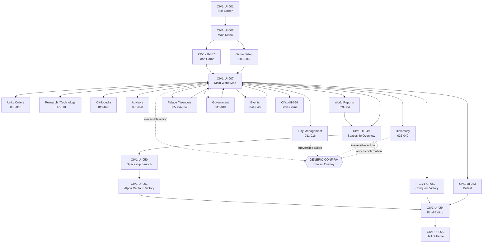

# Civ1-Inspired Overall Scene Graph

This document is the canonical navigation map for the Civilization-I-inspired UI reference in `docs/ui/civ1/`.

It is intentionally a **client navigation contract**, not a game-rules state machine. The engine remains authoritative for whether a transition is legal; the client uses this graph to decide which scene family to render after receiving authoritative state/events.

Stable scene IDs correspond to `SCENE_INDEX.md`.

## Overall ASCII scene graph

```text
                                      CIVILIZATION CLONE
                                             |
                                      CIV1-UI-001
                                       TITLE SCREEN
                                             |
                                      CIV1-UI-002
                                        MAIN MENU
                                  _________|_________
                                 /                   \
                                v                     v
                         CIV1-UI-003              CIV1-UI-057
                         WORLD CREATION             LOAD GAME
                                |
                         CIV1-UI-004
                         DIFFICULTY
                                |
                         CIV1-UI-005
                    CIVILIZATION / LEADER
                                |
                         CIV1-UI-006
                      OPENING / DAWN
                                |
                                v
+================================================================================+
|                         CIV1-UI-007 MAIN WORLD MAP                             |
|                                                                                |
|  +----------------+  +----------------+  +----------------+  +---------------+ |
|  | UNIT / ORDERS  |  | ADVISORS      |  | WORLD REPORTS  |  | CIVILOPEDIA   | |
|  | 008,009,010    |  | 021-028       |  | 029-034,049    |  | 019-020       | |
|  +-------+--------+  +-------+--------+  +-------+--------+  +-------+-------+ |
|          |                   |                   |                   |          |
|          |                   |                   |                   |          |
|          +-------------------+-------------------+-------------------+          |
|                                      |                                         |
|             +------------------------+-------------------------+               |
|             |                        |                         |               |
|             v                        v                         v               |
|       CITY / PRODUCTION        RESEARCH / TECH             DIPLOMACY           |
|         011-016                  017-018                  036-040              |
|             |                        |                         |               |
|             +------------------------+-------------------------+               |
|                                      |                                         |
|                              RETURNS TO MAP                                    |
+======================================+=========================================+
                                       |
             +-------------------------+------------------------------+
             |                         |                              |
             v                         v                              v
        GOVERNMENT                  EVENTS                    PRESENTATION
         041-043                  044-046                    035,047-048
             |                         |                              |
             +-------------------------+------------------------------+
                                       |
                                       v
                               CIV1-UI-007 MAP
                                       |
                                       v
                                SPACE RACE 049
                                       |
                                CIV1-UI-050
                              SPACESHIP LAUNCH
                                       |
                          +------------+-------------+
                          |                          |
                          v                          v
                    CIV1-UI-051                CIV1-UI-052
                  ALPHA CENTAURI                CONQUEST
                      VICTORY                    VICTORY
                          \                          /
                           \                        /
                            +----------+-----------+
                                       |
                                  CIV1-UI-054
                                  FINAL RATING
                                       |
                                  CIV1-UI-055
                                  HALL OF FAME

Alternative terminal path:

    CIV1-UI-007 --civilization destroyed / terminal loss--> CIV1-UI-053 DEFEAT
                                                         |
                                                         v
                                                   CIV1-UI-054
                                                         |
                                                         v
                                                   CIV1-UI-055

Persistence paths:

    CIV1-UI-002 -------------------------------> CIV1-UI-057 LOAD GAME
    CIV1-UI-007 -------------------------------> CIV1-UI-056 SAVE GAME
    CIV1-UI-056 --saved/cancel-----------------> CIV1-UI-007
    CIV1-UI-057 --loaded-----------------------> CIV1-UI-007

Shared overlay:

    ANY ELIGIBLE SCENE ---> GENERIC-CONFIRM ---> confirm / cancel ---> caller
```

## High-level Mermaid scene graph



## Detailed Mermaid scene graph

The detailed graph keeps every canonical scene ID visible. Edges represent common UI navigation rather than every engine-generated transition.

```mermaid
flowchart TD
    U001["001 Title Screen"] --> U002["002 Main Menu"]
    U002 --> U003["003 World Creation"]
    U002 --> U057["057 Load Game"]
    U003 --> U004["004 Difficulty Selection"]
    U004 --> U005["005 Civilization / Leader Selection"]
    U005 --> U006["006 Opening / Dawn"]
    U006 --> U007["007 Main World Map"]
    U057 --> U007

    subgraph STRATEGIC["Strategic map and city loop"]
        U007 <--> U008["008 Orders Menu"]
        U007 <--> U009["009 Tile Information"]
        U007 <--> U010["010 Unit Information"]
        U007 --> U011["011 Found City"]
        U011 --> U012["012 City Management"]
        U007 <--> U012
        U012 <--> U013["013 Change Production"]
        U012 <--> U014["014 Buy Production"]
        U012 <--> U015["015 Sell Improvement"]
        U012 <--> U016["016 City View"]
    end

    subgraph KNOWLEDGE["Research and Civilopedia"]
        U007 --> U017["017 Choose Research"]
        U017 --> U007
        U007 --> U018["018 Technology Discovered"]
        U018 --> U017
        U007 <--> U019["019 Civilopedia Browser"]
        U019 <--> U020["020 Civilopedia Entry"]
    end

    subgraph ADVISOR["Advisors"]
        U007 <--> U021["021 Advisors Hub"]
        U021 <--> U022["022 City Status Advisor"]
        U021 <--> U023["023 Military Advisor"]
        U021 <--> U024["024 Intelligence Advisor"]
        U021 <--> U025["025 Attitude Advisor"]
        U021 <--> U026["026 Trade Advisor"]
        U026 <--> U027["027 Tax/Luxury/Science Rates"]
        U021 <--> U028["028 Science Advisor"]
    end

    subgraph WORLD["World reports"]
        U007 <--> U029["029 World Menu"]
        U029 <--> U030["030 Wonders of the World"]
        U029 <--> U031["031 Top Five Cities"]
        U029 <--> U032["032 Civilization Score"]
        U029 <--> U033["033 Known World Map"]
        U029 <--> U034["034 Demographics"]
        U029 <--> U049["049 Spaceship Overview"]
    end

    subgraph DIPLOMACY["Diplomacy"]
        U007 --> U036["036 First Contact"]
        U036 --> U037["037 Diplomacy Conversation"]
        U037 <--> U038["038 Technology Exchange"]
        U037 <--> U039["039 Tribute / Demand"]
        U037 --> U007
        U007 --> U040["040 Diplomat at Foreign City"]
        U040 --> U007
    end

    subgraph GOV_EVENTS["Government, events, and presentation"]
        U007 --> U035["035 Palace"]
        U035 --> U007
        U007 --> U041["041 Revolution"]
        U041 --> U042["042 Form a Government"]
        U042 --> U043["043 New Cabinet"]
        U043 --> U007
        U007 --> U044["044 Barbarian Warning"]
        U044 --> U007
        U007 --> U045["045 Civil Disorder"]
        U045 --> U012
        U045 --> U007
        U007 --> U046["046 City Captured"]
        U046 --> U007
        U007 --> U047["047 Wonder Completed"]
        U047 --> U048["048 Wonder Illustration"]
        U048 --> U007
    end

    subgraph ENDGAME["Space race and endgame"]
        U007 --> U049
        U049 --> U050["050 Spaceship Launch"]
        U050 --> U051["051 Alpha Centauri Victory"]
        U007 --> U052["052 Conquest Victory"]
        U007 --> U053["053 Defeat"]
        U051 --> U054["054 Final Rating"]
        U052 --> U054
        U053 --> U054
        U054 --> U055["055 Hall of Fame"]
    end

    U007 <--> U056["056 Save Game"]

    CONFIRM{{"GENERIC-CONFIRM"}}
    U008 -. destructive order .-> CONFIRM
    U012 -. sell / spend .-> CONFIRM
    U037 -. declare war / commitment .-> CONFIRM
    U049 -. launch .-> CONFIRM
```



## Scene-family ownership map


## Navigation rules

1. `CIV1-UI-007` is the primary gameplay navigation hub.
2. `CIV1-UI-012` is the primary city-management hub and normally returns to `CIV1-UI-007`.
3. Advisor, world-report, and Civilopedia scenes are read/inspect branches and should preserve the underlying gameplay context when closed.
4. Diplomacy, government changes, discoveries, warnings, captures, palace rewards, and wonder scenes may be entered because of authoritative engine events rather than direct menu selection.
5. `CIV1-UI-049` is reachable from the world-report surface and may also be exposed directly once the space program is relevant.
6. Victory and defeat converge on `CIV1-UI-054`, then `CIV1-UI-055`.
7. `CIV1-UI-056` and `CIV1-UI-057` are persistence surfaces, not game-rule owners.
8. `GENERIC-CONFIRM` is an overlay, not a canonical scene, and must return to its caller on cancel.
9. A client may visually combine scenes on large displays, but stable scene IDs and actions should remain individually addressable for testing and accessibility.
10. Engine events always outrank client assumptions: the graph documents expected UX flow, while the engine determines legality and authoritative next state.
